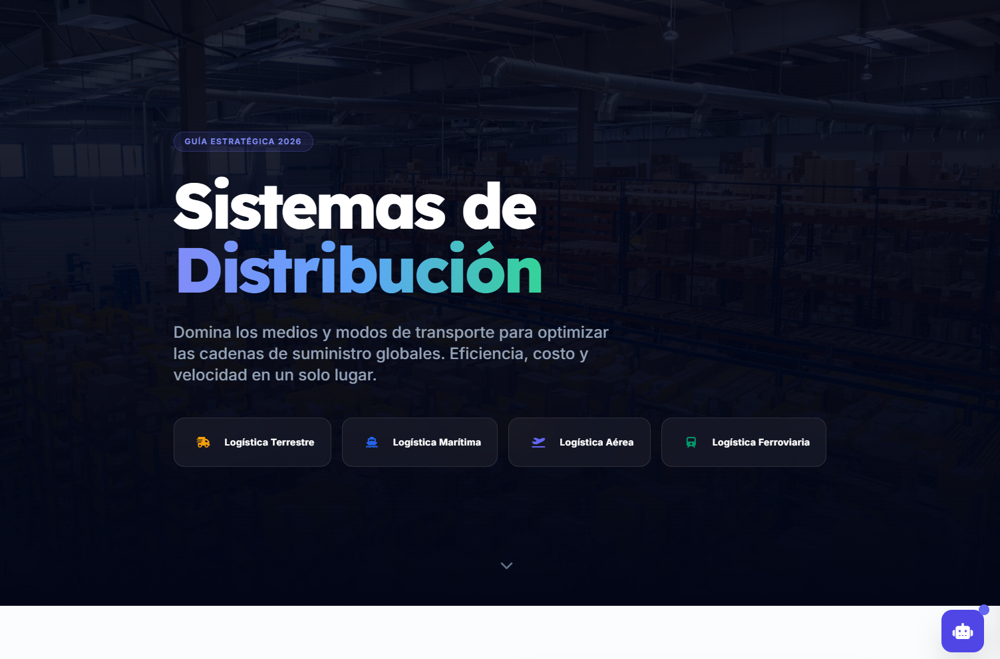

[](https://github.com/clr-techlead/Sistemas-de-distribucion-en-operaciones-de-comercio-exterior/actions/workflows/node-ci.yml)

# International Transport Mode Comparison for Foreign Trade

A React + TypeScript web application for comparing international transport modes — road, maritime, and air — to support logistics decisions in foreign-trade operations, with a domain-focused AI assistant.

> Built as a practical complement to my technical training in Foreign Trade Operations (SENA), combining international logistics knowledge with software development skills.

🔗 **Live demo:** https://sistemas-de-distribucion-en-operaci.vercel.app

## Preview



## What it does

- **Transport mode comparison** (road, maritime, and air), with a profile for each mode covering means of transport, advantages, disadvantages, and applicable regulations.
- **Criteria-based scoring** — cost, speed, capacity, flexibility, and environmental impact — with visual high / medium / low indicators.
- **AI logistics assistant** (Gemini API) that answers questions about multimodal transport, with a focus on efficiency, costs, and international regulations.

## Tech stack

- React + TypeScript
- Vite
- Google Gemini API (`@google/genai`) for the conversational assistant

## Run locally

**Requirement:** Node.js

```bash
npm install
```

Create a `.env.local` file in the project root with your own Gemini API key:

```
API_KEY=your_api_key_here
```

```bash
npm run dev
```

> The API key is never exposed in the source code: it is read from environment variables (`process.env.API_KEY`). Anyone running the project locally must use their own key.

## Project structure

- `components/` — reusable interface components for the transport comparison experience.
- `services/` — integration layer for the Gemini API assistant.
- `App.tsx` — main application composition and user flow.
- `types.ts` — shared TypeScript models used across the application.
- `.github/workflows/` — automated Node.js CI checks on every push and pull request.

## Deployment

The production application is deployed on Vercel:

🔗 **Live deployment:** https://sistemas-de-distribucion-en-operaci.vercel.app

Configure `API_KEY` in Vercel project settings as an environment variable. Do not commit API keys to the repository.

## Roadmap

- Add automated unit and integration tests for the scoring logic and key user flows.
- Improve API error handling and loading states for the AI assistant.
- Add result export capabilities for logistics analysis and reporting.
- Evaluate multilingual support for international users.

## Context

This project started from a real learning need: quickly understanding the differences between transport modes to make better logistics decisions. I built it to practice React, TypeScript, and AI API integration within a domain I know firsthand.
